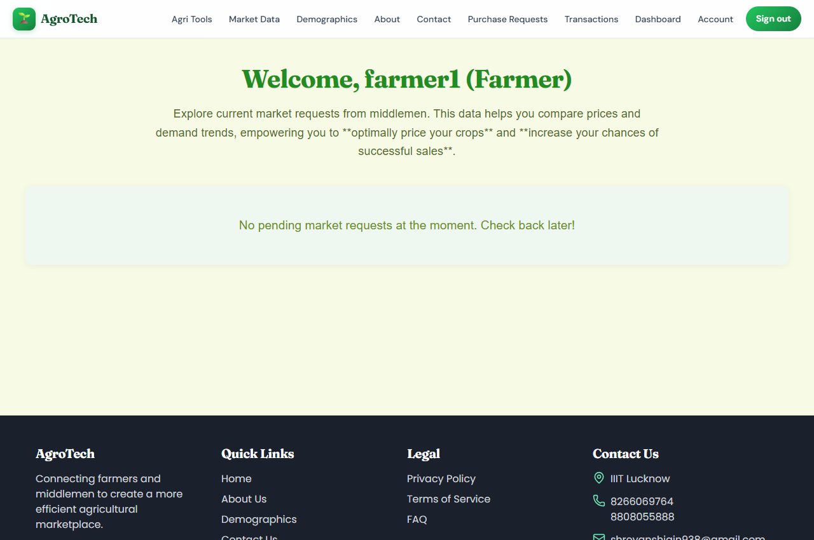
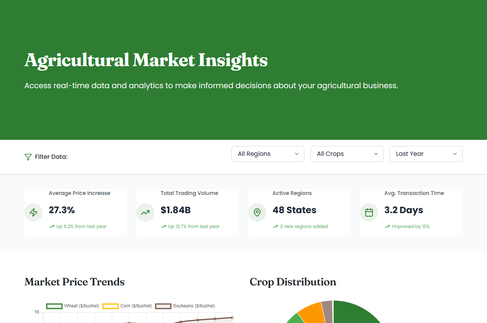
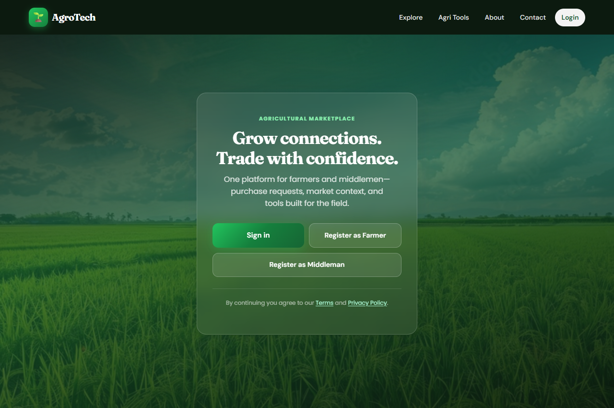
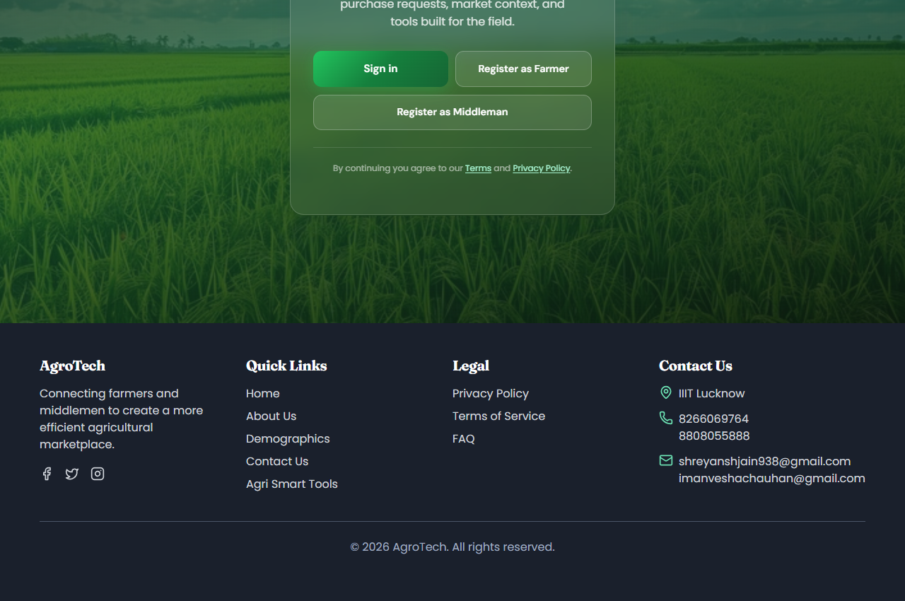

# 🌿 AgroTech — Connecting Farmers and Middlemen

**Live Demo**: [https://agrotech.vercel.app](https://agrotech.vercel.app)
**GitHub Repository**: [https://github.com/Shreyanshjain3725/AgroTech](https://github.com/Shreyanshjain3725/AgroTech)
AgroTech is a modern, full-stack digital marketplace designed to bridge the gap between agricultural producers (**Farmers**) and distributors (**Middlemen**). By providing real-time demand comparisons, region-specific price trends, and direct purchase channels, the platform empowers farmers to optimally price their crops and negotiate fair deals, eliminating excessive intermediary layers.

---

## 📸 Application Screenshot Tour

Below are live screenshots captured directly from the running AgroTech application, showcasing the interfaces for both Farmer and Middleman workflows.

### 1. Farmer Dashboard
The main client interface where farmers are greeted with a customized action hub, showing real-time market opportunities, demand trends, and pricing highlights to optimize sales.


### 2. Demographics & Market Visualization
An interactive graphing and analytics dashboard allowing users to visualize regional distributions of crop demand, seasonal yields, and market pricing histories.


### 3. Purchase Request Center
Middlemen can submit crop Purchase Requests specify requirements, quantities, and price offers, which are then broadcasted to eligible farmers.


### 4. User Profile & Preferences
Both Farmers and Middlemen can manage their business profiles, upload credentials, specify crop lists, set preferred market regions, and link contact channels.


### 5. Brand Identity & Footer
Clean branding and layout with responsive navigation and integrated footer systems.


---

## 🚀 Key Features

*   **Dual Portal Authentication**: Separate registration and specialized UI flows for **Farmers** (sellers) and **Middlemen** (buyers).
*   **Simple Authentication**: Secured via robust Basic Authentication matching hashed database credentials.
*   **Market Request Hub**: Middlemen publish purchase requests. Farmers review listing requirements and fulfill them.
*   **Demographic Visualizers**: Interactive charts documenting crop production shares, regional demands, and price curves.
*   **AgriSmart Tools**: Utility widgets for helping farmers plan optimal crop yields based on climate and market conditions.
*   **Self-Contained Dev Database**: Embedded In-Memory MongoDB Runner allows developers to run, test, and seed the project without installing local database binaries.

---

## 🛠️ Tech Stack

### Frontend
- **Framework**: React 19 (React-Router-DOM v7)
- **Styling**: TailwindCSS v4, Bootstrap v5 (Vanilla CSS components)
- **Charts / Graphics**: Chart.js, React-Chartjs-2
- **Network Client**: Axios
- **Design Icons**: Lucide React

### Backend
- **Server Framework**: Node.js & Express
- **Database driver**: Mongoose (MongoDB)
- **Security**: Bcrypt.js (Password Hashing)
- **Utility Tools**: Nodemon, Dotenv, Multer

---

## 📂 Project Directory Structure

```text
agrotech/
├── agrotech-frontend/    # React frontend client application
│   ├── src/             # Application source files (pages, components, context, etc.)
│   └── package.json     # Client-side configuration and scripts
├── server/               # Express & Node.js backend server
│   ├── src/             # Backend server routes, models, middleware, and entrypoints
│   ├── run-db.js        # Helper script to launch In-Memory MongoDB server
│   └── package.json     # Server-side configuration and script actions
└── backend/              # Alternate Java Spring Boot backend folder
```

---

## ⚙️ Quick Start Installation & Setup

Follow these steps to launch the entire stack on your local workspace.

### Core Requirements
- **Node.js** v18+ 
- **NPM** v9+

---

### Step 1: Start the In-Memory MongoDB Server
To make startup completely zero-configuration, we have packaged an in-memory database server. Developers do not need to install MongoDB globally on their machines.

1. Open a new terminal.
2. Navigate to the `server` directory and install the database server dependencies:
   ```bash
   cd server
   npm install
   ```
3. Run the in-memory database:
   ```bash
   npm run db
   ```
   *The database will start listening on port `27017` in the background.*

---

### Step 2: Launch the Backend Express API
1. Open a second terminal.
2. Navigate to the `server` directory.
3. Start the Node.js backend:
   ```bash
   cd server
   npm start
   ```
   *The API will start listening and connect to the database at `http://localhost:5000`.*

---

### Step 3: Launch the React Client App
1. Open a third terminal.
2. Navigate to the `agrotech-frontend` directory.
3. Install the client-side packages:
   ```bash
   cd agrotech-frontend
   npm install
   ```
4. Start the development server:
   ```bash
   npm start
   ```
   *Your default web browser should open automatically displaying the application at `http://localhost:3000`.*

---

## 👤 Verification Credentials
You can register new Farmers/Middlemen directly in the registration pages, or use our pre-configured test account for immediate access:
*   **Role**: Farmer
*   **Username**: `farmer1`
*   **Password**: `Password123`

---

## ☁️ Deploying to Vercel
When deploying to Vercel, the in-memory MongoDB will not be available. You must connect to a cloud MongoDB provider (like MongoDB Atlas) and add the connection string to your Vercel project's Environment Variables:
1. Go to your project settings in Vercel.
2. Add a new Environment Variable named `MONGODB_URI`.
3. Set the value to your MongoDB connection string (e.g., `mongodb+srv://<user>:<password>@cluster.mongodb.net/agrotech`).
4. Redeploy your project. This is required for Login and Signup to function properly in production.
